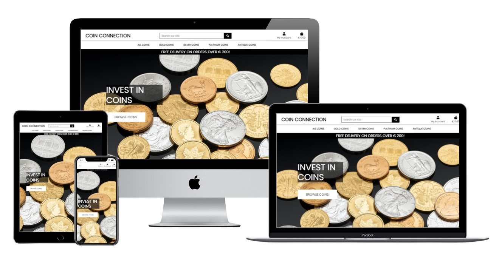
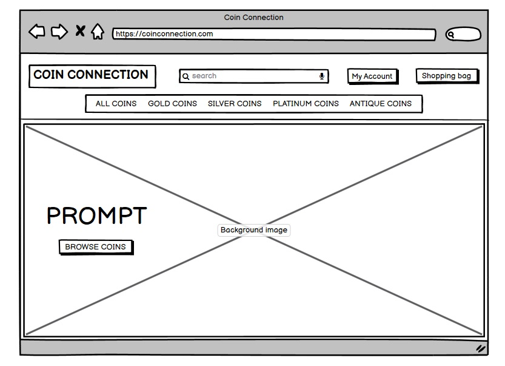
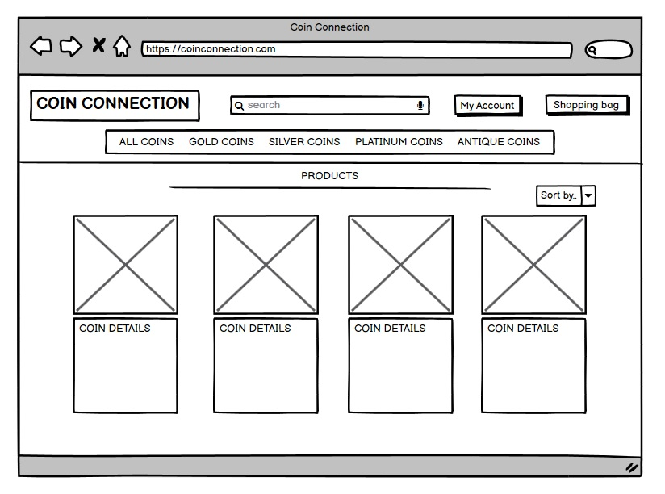
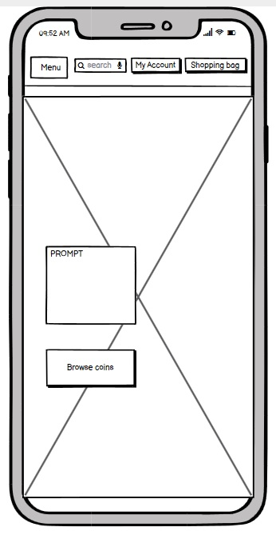
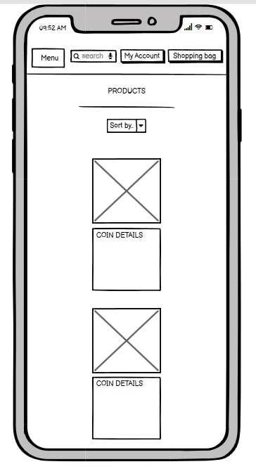
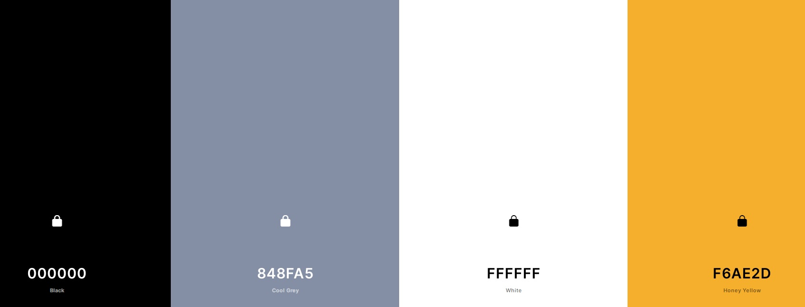
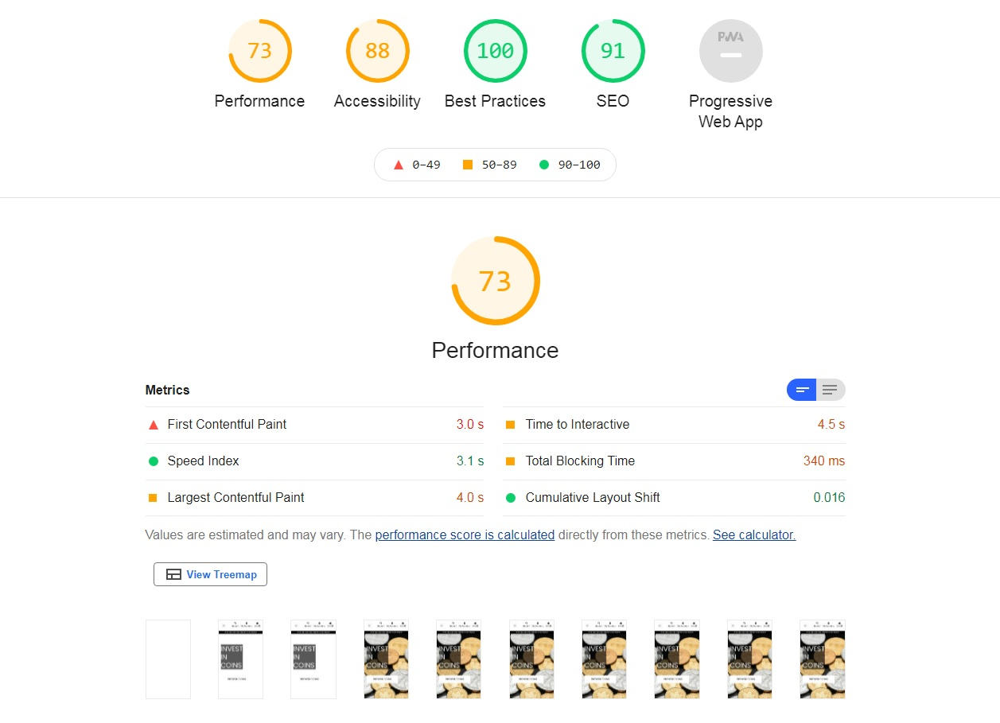

# Coin Connection

[]( https://ms4-coin-connection.herokuapp.com/)

Coin Connection is an e-commerce website for people to buy bullion or antique coins. The site is not directed entirely to numismatists but to people who may want to buy coins as an investment also.

- [UX](#ux)
  - [Project Goal](#project-goal)
  - [User Stories](#user-stories)
    - [User Stories for Customers](#user-stories-for-customers)
    - [User Stories for Administrators](#user-stories-for-admin)
  - [Wireframes](#wireframes)
  - [Data Structure](#data-structure)
  - [Design](#design)
    - [Typography](#typography)
    - [Colours](#colours)
- [Features](#features)
  - [Existing Features](#existing-features)
    - [Home Page](#home-page)
    - [Product Page](#product-page)
    - [Product View](#product-view)
    - [User's Profile Page](#profile-page)
    - [User Login and Sign-Up](#user-account)
    - [Shopping Bag](#shopping-bag)
    - [Secure Checkout](#secure-checkout)
    - [Administrator features](#admin-features)
  - [Possible Future Features](#possible-future-features)
- [Testing](#testing)
- [Deployment](#deployment)
  - [Local Deployment](#local-deployment)
  - [Deployment to Heroku](#deployment-to-heroku)
- [Technologies](#technologies)
- [Tools Used](#tools)
  - [Design Library](#design-library)
- [Credits](#credits)
  - [Media](#media)
  - [Acknowledgements](#acknowledgements)

---

Welcome to Coin Connection - the e-commerce website for Numismatists and investors to purchase antique and bullion coins. Users will be able to register/login, create a profile and purchase coins.

Access the site: <https://ms4-coin-connection.herokuapp.com/>

[](https://ms4-coin-connection.herokuapp.com/)


### Project Goal

This is my fourth and final Milestone Project in Code Institute's Fullstack Development program. The purpose of this project was to create an e-commerce site using the Django framework, static file hosting with AWS, and a functional payment system with Stripe. The e-commerce section of the site is fully functional, Stripe payments and webhooks are operational and all static files, including media (images) are located at Amazon Web Services (AWS). I think the site has great potential to grow with additional features to be added in the future.

My site was inspired by Code Institute's tutorials for the Boutique Ado project: [Boutique Ado Code](https://github.com/Code-Institute-Solutions/boutique_ado_v1/)

## UX

### User Stories

#### User Stories for Customers

User Stories for Customers at [Coin Connection](<(https://ms4-coin-connection.herokuapp.com/)>)
A customer would like to: | Page(s) associated:
--- | --- 
Browse for coins | <https://ms4-coin-connection.herokuapp.com/products/>
Register using email | <https://ms4-coin-connection.herokuapp.com/accounts/signup/>
Login to an account using email | <https://ms4-coin-connection.herokuapp.com/accounts/login/>
Search coins | <https://ms4-coin-connection.herokuapp.com/products/?q=gold>
Sort coins based on categories | <https://ms4-coin-connection.herokuapp.com/products/?sort=category&direction=asc>
Sort coins by region | <https://ms4-coin-connection.herokuapp.com/products/?sort=region&direction=asc>
Sort coins by material | <https://ms4-coin-connection.herokuapp.com/products/?sort=material&direction=asc>
Sort coins by price | <https://ms4-coin-connection.herokuapp.com/products/?sort=price&direction=asc>
Read coin descriptions | <https://ms4-coin-connection.herokuapp.com/products/2/>
Buy a coin/coins and view in a shopping cart before purchase | <https://ms4-coin-connection.herokuapp.com/bag/>
Update the number of items in the shopping cart before purchase | <https://ms4-coin-connection.herokuapp.com/bag/>
Know how much delivery will cost and when the free delivery threshold activates | <https://ms4-coin-connection.herokuapp.com/bag/>
Pay by using a credit card in from a safe and reputable source | <https://ms4-coin-connection.herokuapp.com/checkout/>
Buy a coin and have the item delivered to a confirmed address | <https://ms4-coin-connection.herokuapp.com/checkout/>
Create a profile | <https://ms4-coin-connection.herokuapp.com/profile/>
Review order history | <https://ms4-coin-connection.herokuapp.com/profile/>
Update profile information | <https://ms4-coin-connection.herokuapp.com/profile/>

#### User Stories for Coin Connection Administrators/Superuser

Admin Stories for site administrators at [Coin Connection](<(https://ms4-coin-connection.herokuapp.com/)>)
-- _note: some pages may not be accessible without being an administrator or superuser. Request access via email_
An admin would like to: | Page(s) associated:
--- | ---
Add a product | <https://ms4-coin-connection.herokuapp.com/products/add/> -- (only viewable when logged in as an administrator/Superuser)
Update a product | <https://ms4-coin-connection.herokuapp.com/products/3/> -- (only viewable when logged in as an administrator/Superuser)
Delete a product | <https://ms4-coin-connection.herokuapp.com/products/3/> -- (only viewable when logged in as an administrator/Superuser)

- _The above details the types of actions an administrator/Superuser can do from the website, however, all administrators/Superuser will also have access to the database through Django's admin panel._


### Wireframes

Following the user stories, wireframes were drawn to provide a starting point and guidance throughout the development process. Some minor changes occurred during production but I kept the design to the Boutique Ado design as it works well.

#### Desktop Wireframes

The home page on desktop



The products page on desktop



#### Mobile Wireframes

The home page on mobile



The products page on mobile



To aid the user experience, the pages follow the same design. Navigation, menu options etc are carried through in each page.


### Data structure

The database structure uses postgres database and the schema for the coins are as follows:
- Categories: 'Friendly name', 'Name'
- Products: 'SKU', 'Name', 'Description', 'Region', 'Price', 'Material', 'Purity', 'Weight', 'Image'


### Design

The application was built using Bootstrap. The font, colours and design were all chosen to give a sleek, clean and clear look to the site.
The responsiveness was developed so users can have a pleasant experience on desktop, laptop, tablet or mobile.

#### Typography

The google font "Poppins" regular 400 was used throughout the site, again to give a sleak look and it is easy to read: <https://fonts.google.com/specimen/Poppins>
The site also uses [Fontawesome](https://fontawesome.com/) icons throughout.

#### Colours

Colours were chosen to best reflect to clean look of black and white along with the silver and gold of bullion.
The colour scheme was generated using [Coolors](https://coolors.co/)



## FEATURES

### Existing Features

#### Home Page

- The first thing a user will see when entering the site is a large full-cover background picture depicting a collection of various Gold, Silver and Platinum coins.
- A large banner spreading the width of the page indicates free delivery on orders over a certain amount.
- A large prompt to invest in coins and a button with "Browse coins" is displayed over the background image.
- Users can access all coins in the navbar and "Browse coins" button and access their own profiles through the My Account navigation icon
- Users can search through the various pages in the site for all coins that are available to purchase

#### Product Page

- Products are shown with an image against a white card background with details of the coin under each image.
- Products page has a sorting function where the coins can be sorted by price, material, region or category in ascending and descending order.
- Product images link to the product detail page where a product description is also available
- each Product card displays:
  - Product Image
  - Product Name
  - Price
  - Category
  - Material
  - Region
- Scroll to top function located bottom right as an arrow
- Administrators will have access to Edit and Delete options on products

#### Product View

- A larger, clickable display picture
- Name of item
- Price
- Category
- Purity
- Weight
- Region
- Administrators will have access to Edit and Delete options on products
- Description
- Quantity to add to bag
- Keep shopping button
- Add to bag button
- Clicking on "add to bag" brings up a *toast* which allows a user to go their bag and adjust their order accordingly

#### Profile Page

- My Profile displayed at the top
- Your information in a form that can be updated
  - Phone number
  - Street Address 1
  - Street Address 2
  - Town or city
  - County, state or locality
  - Postal code
  - Country
- Update Information button
- Order history (right hand panel on large screens)
  - Order number
  - Date
  - Items
  - Order total
  - Clickable order number with link to the order

#### User Account

- Login via email
- Sign up with email, an encrypted password is stored for security

##### Shopping Bag

- Notifies user when empty
- Displays:
  - Product image
  - Product name
  - SKU	
  - Price
  - Update quantity
  - Subtotal
  - Remove item
  - Bag total
  - Delivery/Delivery threshold
  - Grand total
  - Button link to secure checkout or keep shopping

#### Secure Checkout

- User information form:
  - Full Name
  - Email
  - Phone number
  - Street Address 1
  - Street Address 2
  - Town or City
  - County, State or Locality
  - Postal code
  - Country
  - A tick box to save the delivery information to profile
  - Card information (secured by Stripe)
- Order summary:
  - Product image
  - Item name
  - Quantity
  - Subtotal
  - Order total
  - Delivery/Delivery threshold
  - Grand total
- Complete order button or Adjust bag button
- A warning showing that your card will be charged the grand total

#### Administrator/Superuser Features

- On my account, an administrator/Superuser has an additional option for coin management where they can add coins to the database and shop
- On product pages, an administrator/Superuser has additional links to edit a products information or delete the product from the shop
- Administrators/Superusers have access to Django's Admin Panel

#### Possible Future Features

Some possible future features that could be implemented would be:
  - A live in-running bullion price widget for Gold, Silver and Platinum
  - A connection to the live price to update coin prices on the site
  - A forum where customers can request coins or offer coins that they would like to sell


## TESTING

Testing was done manually throughout the development process. 

### Navigation

All links were checked and work as intended. Some links, such as coin management requires a login, therefore, even if a user tries to force the page (whether logged in or not), and are not part of the administrative team, the user will be denied access.

#### Mobile Navigation

A hamburger style collapse is in operation for users on small screen devices.

#### Desktop Navigation

A full width navbar is in operation allowing users to see their options in an easy to follow format.


### Home Page and Products

#### Home Page

A user must be logged in to go to their profile. If a user attempts to purchase an item without being logged in, they will be given the option to create an account or login to save the information.

#### Products Page

The products pages display the details for each coin.
The "back to top" button works as expected. Administrators can edit and delete products, but must be logged in at the time.

#### Search

Searching works to find coins that are located on the product pages.

#### Filtering/Sorting

Filtering works in all the products pages.

#### Product Details

Administrators can edit and delete products, but must be logged in at the time.

#### Add Product (Administrative)

Admin can add a product to the page and images upload to AWS and these additions are available instantly.

#### Edit Product (Administrative)

Admin can edit product details or change an image.

#### Shopping Bag

The shopping bag displays all items selected by the user.
Updating the quantities of products in the bag works as intended.
It is possible to remove an item from the bag.
The delivery charges/threshold updates immediately to show costs involved if applicable.
Clicking "Secure Checkout" leads to the checkout page.
If the shopping cart is empty, it is displayed as such.

#### Secure Checkout

Form loads appropriately.
Items added reflect user's purchase requests.
Items display with their correct price, image, name and quantity.
New profile information updates if requested.
Stripe payment and webhooks work as anticipated, payments are accepted using test cards.
Unsuccessful payments return message with appropriate information.

#### User Profile

Full address details are available for input.
Updating individual fields updates the information on the profile and also for checkout.
Order history is displayed as anticipated and provides a full user purchase history.
The user's email as displayed is the email used to receive information about purchases.

#### Login and Logout

A user can create an account using their email and successfully login with their password. User's can logout when they request to do so and will receive a toast notification. The choice can be made at login whether to store your login details to save logging in each time. This is done with a checkbox "remember me".

### Responsiveness

This application was tested for responsiveness across a variety of devices to ensure content remained readable and editable on various screen sizes.

The navigation, layout and various functionalities (login, logout, add, view, delete and update reviews) were tested across various screen sizes with Chrome Developer Tools.

These tests were performed on the following devices and browsers:

    Samsung Internet on Samsung Galaxy S7
    Chrome and Firefox on Windows based 15" Laptop
    Chrome and Firefox on Windows based 24" Desktop

Tests were conducted by various friends and family.

### Known Bugs

All care was taken to ensure all bugs were removed. However, there were a couple of bugs that I encountered during development.
The first bug was identified as a bug in the Code Institute template that prevented me from connecting to the Postgres database and the second bug was identified as a bug in gitpod that prevents the mysql database from being identified. Both bugs require an unset command and work fine after that.

Additionally, all code was validated in the following ways:

HTML - [W3C HTML Validator](https://validator.w3.org/) 

CSS - [W3C Jigsaw Validator](https://jigsaw.w3.org/css-validator/) 

Python - [PEP8 online check](http://pep8online.com/) 

Performance - [Lighthouse performance report](http://pep8online.com/)



## DEPLOYMENT

The application relies on the following services, and accounts will have to be created for them:

- [Amazon AWS](https://aws.amazon.com/)
- [Stripe](https://stripe.com/)
- An email account, [Gmail](https://mail.google.com/)

### Local Deployment

These are the steps to deploy application locally.

1. From the application's [repository](https://github.com/NFox13/MS4-Coin-Connection), click the "code" button and download the zip of the repository.

  Alternatively, you can clone the repository using the following line in your terminal:

```
git clone https://github.com/NFox13/MS4-Coin-Connection
```

2. Access the folder in your terminal window and install the application's required modules using the following command:

```
python -m pip -r requirements.txt
```

3. Create your envionment variables in Gitpod to include the following

Variable | Value
--- | --- |
'DEVELOPMENT' | 'True'
'SECRET_KEY' | '[YOUR_SECRET_KEY]'
'STRIPE_PUBLIC_KEY' | '[YOUR_STRIPE_PUBLIC_KEY]'
'STRIPE_SECRET_KEY' | '[YOUR_STRIPE_SECRET_KEY]'
'STRIPE_WH_SECRET' | '[YOUR_STRIPE_WEBHOOK_SECRET_KEY]'

Please note that you will need to update the `SECRET_KEY` with your own secret key, as well as the Stripe keys and secret variables with those provided by the application.

4. The application can now be run locally. In your terminal, type the command `python manage.py runserver`. The application will be available in your browser at the address `http:127.0.0.1:8000`. The admin panel can be located at `http:127.0.0.1:8000/admin/`.


### Deployment to Heroku

To deploy Coin Connection to Heroku, use the following steps:

1. In Heroku create a new application.
2. From the Heroku dashboard of your application, click on "Deploy", then "Deployment method" and select GitHub to connect the application to your github repository.
3. In the Heroku Resources tab, navigate to the Add-Ons section and search for Heroku Postgres. The hobby level can be selected for this application.
4. Click on the "settings" tab and on the button labelled "Reveal Config Vars". The Postgres add-on will have created a link to the Postgres database.
5. Add the following configuration variables to the application:

Variable | Value
--- | --- |
AWS_ACCESS_KEY_ID | Access key provided by AWS
AWS_SECRET_ACCESS_KEY | Secret access key provided by AWS
USE_AWS | True
DATABASE_URL | Your Postgres URL provided
EMAIL_HOST_PASS | Secret key supplied by email provider
EMAIL_HOST_USER | Your email address
SECRET_KEY | Django's secret key (use [Django secret key generator](https://miniwebtool.com/django-secret-key-generator/))
STRIPE_PUBLIC_KEY | Stripe's public key for testing purposes
STRIPE_SECRET_KEY | For access to Stripe's services use the key provided
STRIPE_WH_SECRET | For Stripe's webhooks use the key provided

6. In the Heroku dashboard, deploy the application.
7. To view the site, click on the link in the "Domains" section.

## TECHNOLOGIES

- HTML
- CSS
- JavaScript / jQuery
- Python
- Django

## TOOLS

- [Github](https://github.com/)
- [Heroku](https://dashboard.heroku.com/apps)
- [Windows Paint](https://support.microsoft.com/en-us/windows/get-microsoft-paint-a6b9578c-ed1c-5b09-0699-4ed8115f9aa9)
- [FontAwesome](https://fontawesome.com/)
- [Google Fonts](https://fonts.google.com/)
- [iloveimg](https://www.iloveimg.com/)
- [tinypng](https://tinypng.com/)
- [unsplash](https://unsplash.com/)
- [Google images](https://www.google.com/imghp?hl=en)

## DESIGN LIBRARY

- [Bootstrap](https://getbootstrap.com/)

## CREDITS

### Media

- Background image: Photo by <a href="https://unsplash.com/@zlataky?utm_source=unsplash&utm_medium=referral&utm_content=creditCopyText">Zlatáky.cz</a> on <a href="https://unsplash.com/s/photos/coin?utm_source=unsplash&utm_medium=referral&utm_content=creditCopyText">Unsplash</a>


### Coin Images

- All coin images were sourced from Google images, cropped using iloveimg.com, resized using microsoft paint and tinified using tinypng.com.


### Acknowledgements

- The site was inspired by the tutorial videos of Code Institute's Boutique Ado site.
- Code Institute's Tutor team were a great help when the answers were not on Slack.
- [Felipe Alarcon](https://github.com/fandressouza) for his feedback, constructive criticism and encouragement.
- Family and friends for their help in testing, support and advice.
